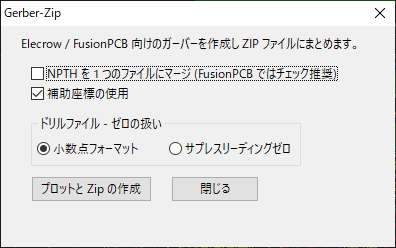
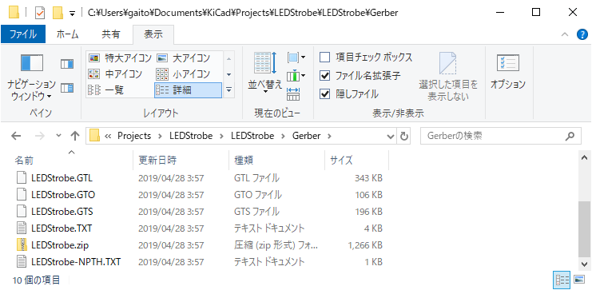

# KiCad script GerberZip

## Overview

* This is an action script supported by KiCad 5.x (except the initial version).
* GerberZip plots the Gerber-files and archives it in a Zip file.
* The Zip-file is in a format that can be submitted to a board vendor such as Elecrow or FusionPCB.
---
* これは KiCad の 5.x (初期版を除く) でサポートされたアクションスクリプトです。
* このスクリプトはガーバーをプロットして Zip ファイルにまとめます。
* Zip ファイルは基板業者の Elecrow または FusionPCB にそのまま送れるフォーマットになっています。
---
## Install
* Deploy `action_menu_gerber_zip.py` and `gerber_zip.png` to the following folder.
---
* `action_menu_gerber_zip.py` と `gerber_zip.png` を以下のフォルダーに配置してください。

#### Linux:

 `/usr/share/kicad/scripting/plugins/`  
or  
 `~/.kicad/scripting/plugins`  
or  
 `~/.kicad_plugins/`  

#### Windows:

   `C:\Users\<UserName>\AppData\Roaming\kicad\scripting`  
  or  
   `C:\Users\Program Files\KiCad\share\kicad\scripting`

Note that the `AppData` is a hidden folder.

Still there may be some problem with the script path on Windows, which may not work in its official directory. It will work if placed in the above folder (confirmed with KiCad 5.1.0).

---
  `C:\Users\<UserName>\AppData\Roaming\kicad\scripting`  
  または  
  `C:\Users\Program Files\KiCad\share\kicad\scripting`  

   なお、`AppData` は隠しフォルダになっている事に注意してください。

Windows でのスクリプトを置くパスに関してはしばらく問題が残っていたらしく、公式のパスでは動作しない場合があります。上のフォルダに置けば動作する事を確認しています (KiCad 5.1.0 で確認)。  

http://docs.kicad-pcb.org/doxygen/md_Documentation_development_pcbnew-plugins.html

---

Launch KiCad (pcbnew) and the GerberZIp will be listed under "Tools" - "External Plugins..." in the menu.

---

KiCad (pcbnew) を起動するとメニューの "ツール" - "外部プラグイン..." にリストされます。

なお、KiCad の言語設定を "日本語" にしている場合は、ダイアログは日本語で表示されます。

---
Gerber-files and the zip-file  are created in the folder "Gerber" under the project.

---
ガーバーとそれをまとめたZipファイルは、プロジェクトの下の "Gerber" というフォルダーに作成されます。

---

