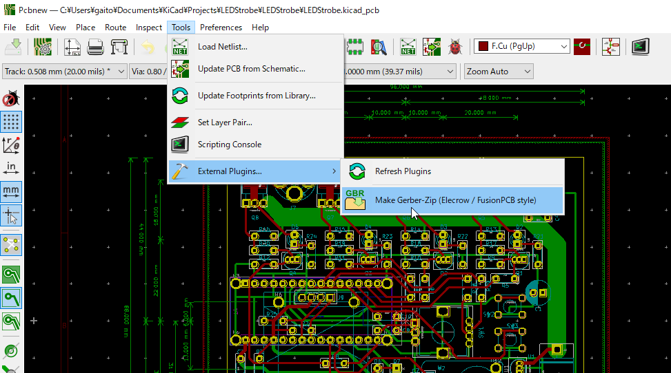
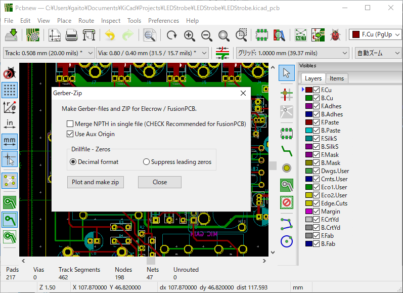
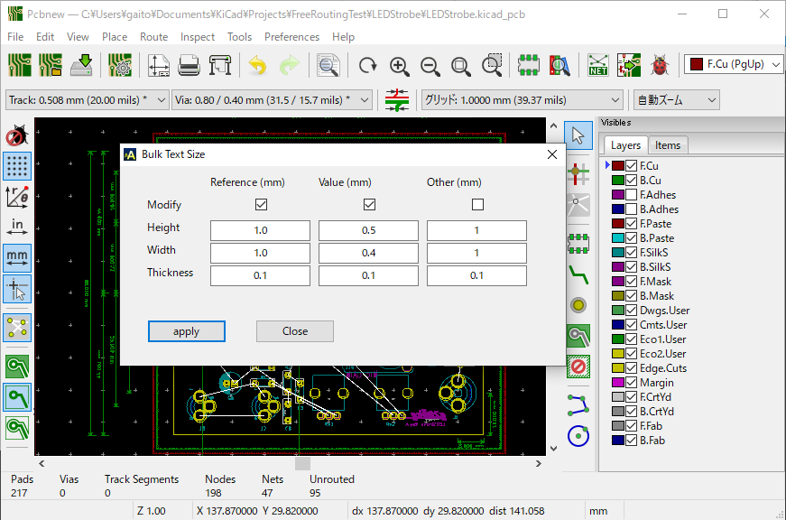

# KiCad action scripts

## Overview

* This is an action script supported by KiCad 5.x (except the initial version).

* これは KiCad の 5.x (初期版を除く) でサポートされたアクションスクリプトです。

## GerberZip
* Plots the Gerber-files and archives it in a Zip file.
* The Zip-file is in a format that can be submitted to a board vendor Elecrow or FusionPCB.
* Gerber-files and the zip-file  are created in the folder "Gerber" under the project.

* このスクリプトはガーバーをプロットして Zip ファイルにまとめます。
* Zip ファイルは基板業者の Elecrow または FusionPCB にそのまま送れるフォーマットになっています。
* ガーバーとそれをまとめたZipファイルは、プロジェクトの下の "Gerber" というフォルダーに作成されます。

## BulkTextSize
* Bulk edit the text size of References, Values, and others.

* リファレンスや定数値のテキストのサイズを一括編集します。

---
## Install and Usage
* Deploy `action_menu_<pluginname>.py` and `action_menu_<pluginname>.png` to the following folder.
* `action_menu_<プラグイン名>.py` と `action_menu_<プラグイン名>.png` を以下のフォルダーに配置してください。

#### Linux:
 `~/.config/kicad/scripting/`  

#### Windows:
 `C:\Users\<UserName>\AppData\Roaming\kicad\scripting`

 #### MacOS:
 `~/Library/Application Support/kicad/scripting`

* Note that the Windows's `AppData` is a hidden folder.
* Windows の `AppData` は隠しフォルダになっている事に注意してください。

---
* Launch plugin from pcbnew's menu "Tools"-"External Plugins ..."
* pcbnew のメニューの "ツール" - "外部プラグイン..." からプラグインを起動できます。

GerberZip:

BulkTextSize:
